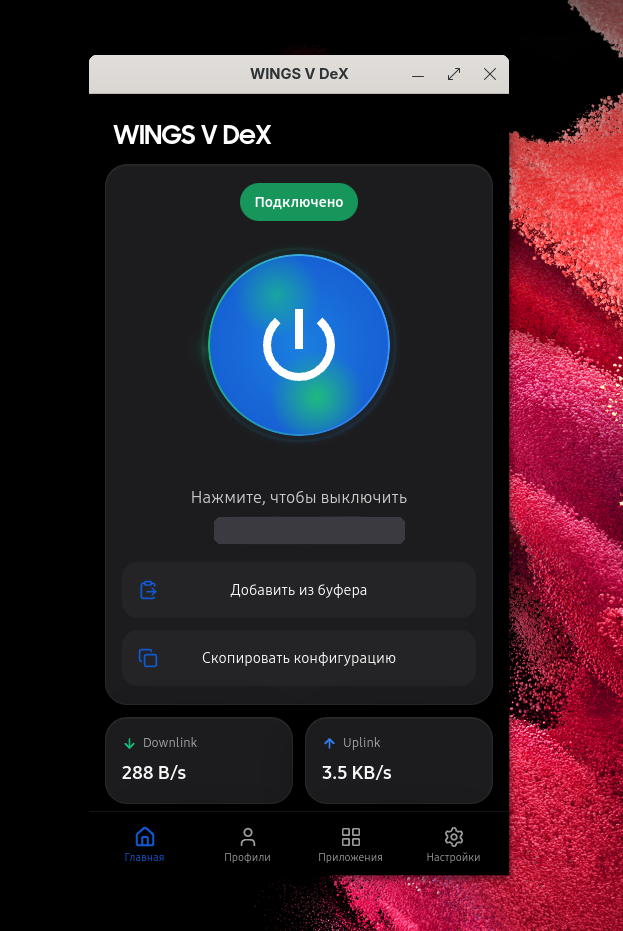
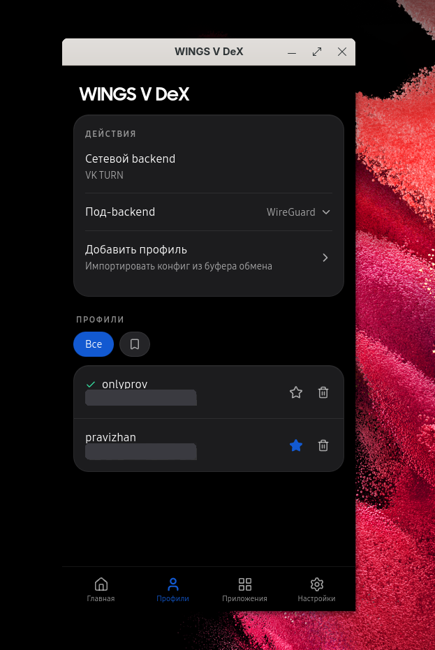
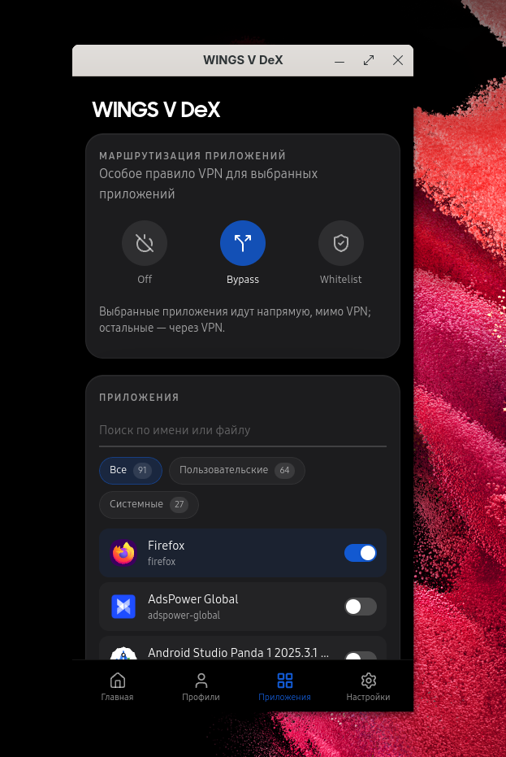
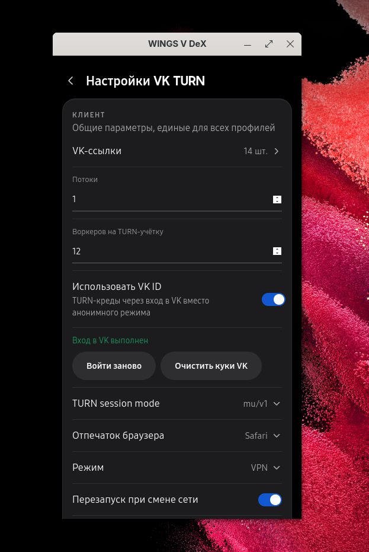
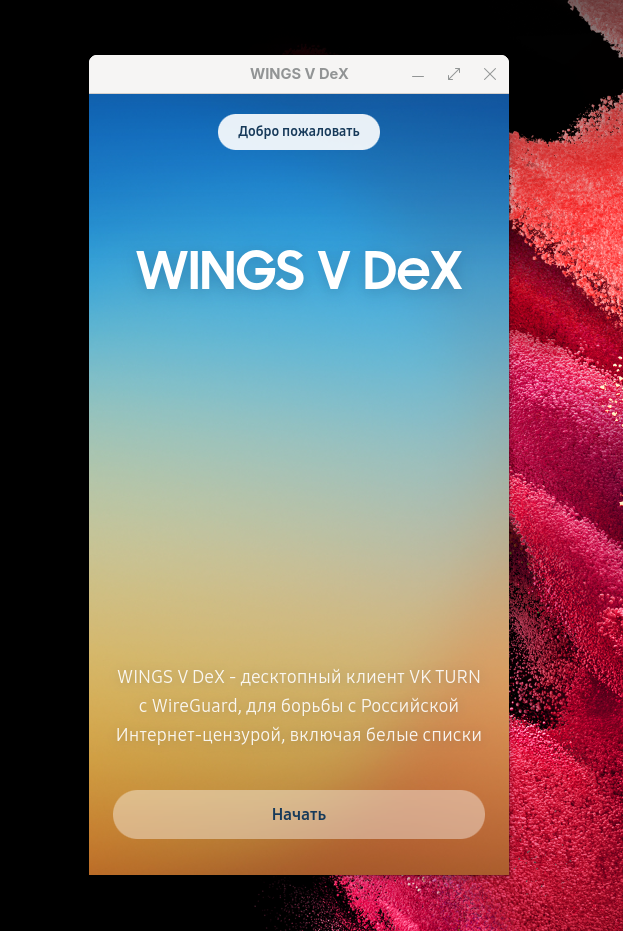
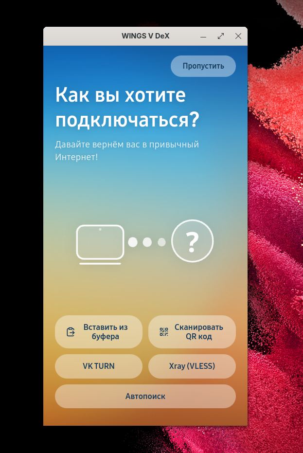
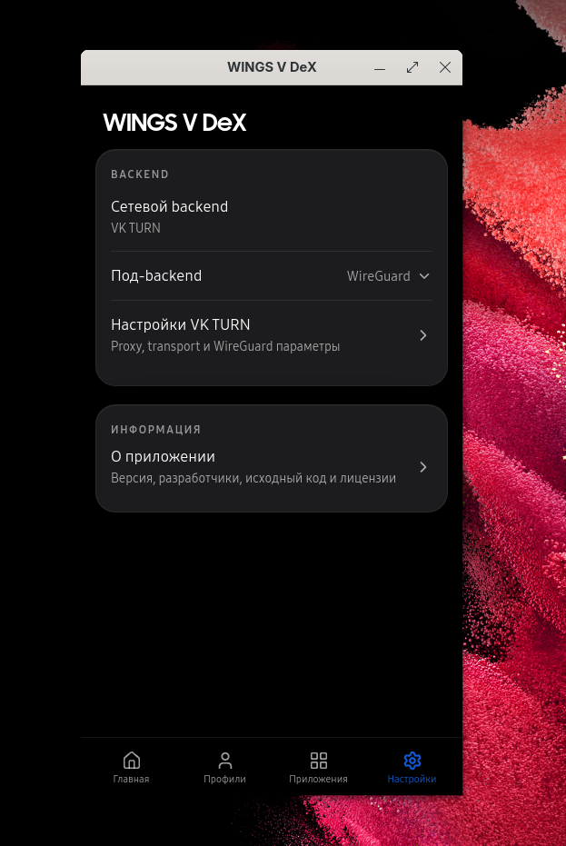
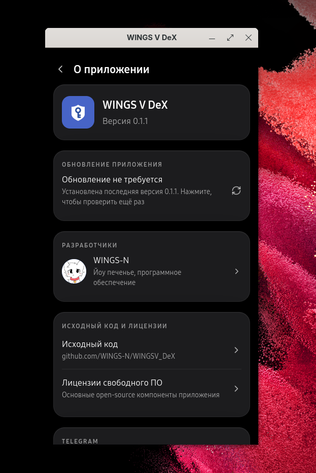

<h1 align="center">WINGS V DeX</h1>

  
  

Настольное приложение для Linux и Windows, которое помогает вернуть привычный интернет там, где его блокируют. Прячет VPN-подключение внутри звонков VK (VK TURN) - для провайдера это выглядит как обычный звонок в VK, а не как VPN. Внутри работает WireGuard.

Это настольная версия клиента [WINGS V для Android](https://github.com/WINGS-N/WINGSV).

## Скриншоты

| | |
| :---: | :---: |
| **Главная** | **Профили** |
|  |  |
| **Маршрутизация приложений** | **Настройки VK TURN** |
|  |  |

Показать ещё скриншоты

| | |
| :---: | :---: |
| **Приветствие** | **Выбор подключения** |
|  |  |
| **Настройки** | **О приложении** |
|  |  |

## Что умеет

- подключаться одной кнопкой
- добавлять профили по ссылке `wingsv://` из буфера обмена
- входить через `VK ID` или работать анонимно
- маршрутизация по приложениям (**только Linux**): пустить выбранные программы напрямую, мимо VPN (`Bypass`), или наоборот - только их через VPN (`Whitelist`)
- показывать журнал подключения (runtime и proxy) прямо в приложении
- обновляться прямо из приложения
- проводить через короткое приветствие при первом запуске

## Установка

Скачайте версию для своей системы со [страницы релизов](https://github.com/WINGS-N/WINGSV_DeX/releases):

- **Linux** - `.deb` (Debian/Ubuntu), `.rpm` (Fedora), `.AppImage` (подойдёт любому дистрибутиву) или архив `.tar.gz`
- **Windows** - установщик `...-setup.exe` или переносимая версия в `.zip`

При подключении приложение один раз попросит повышение прав (pkexec на Linux, UAC на Windows) - это нужно, чтобы поднять VPN.

## С чего начать

1. Запустите приложение и пройдите короткое приветствие.
2. Получите ссылку-профиль `wingsv://` (её выдаёт тот, кто раздаёт вам доступ), скопируйте её и нажмите **«Вставить из буфера»**.
3. Нажмите круглую кнопку - готово, вы подключены.

## Что используется

- `Wails v3` - десктопная оболочка (Go + системный WebView)
- `Vue 3` - интерфейс
- `WireGuard` - VPN-туннель
- `vk-turn-proxy` ([WINGS-N/vk-turn-proxy](https://github.com/WINGS-N/vk-turn-proxy)) - обфускация VK TURN с SRTP-mimicry

## Special thanks to

- [Samsung](https://www.samsung.com/)
- [tribalfs](https://github.com/tribalfs)
- [Yanndroid](https://github.com/Yanndroid)
- [salvogiangri](https://github.com/salvogiangri)
- [zx2c4](https://github.com/zx2c4)
- [cacggghp](https://github.com/cacggghp)
- [Moroka8](https://github.com/Moroka8)
- [samosvalishe](https://github.com/samosvalishe)
- [Amnezia VPN](https://github.com/amnezia-vpn)
